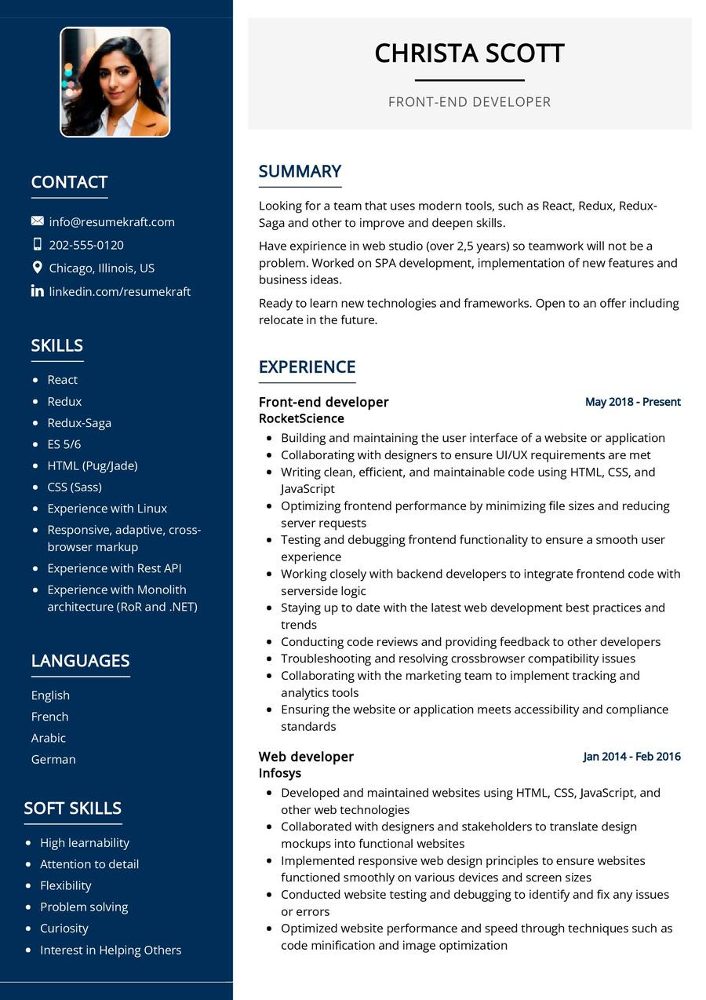

# Desarrollo de Sistemas Web - Frontend 2B

## Práctica Formativa Obligatoria 1: CV Web

Maquetar un CV web en base a un template provisto

## Template a seguir:

Ruta: [./assets/img/template.jpeg](./assets/img/template.jpeg)

